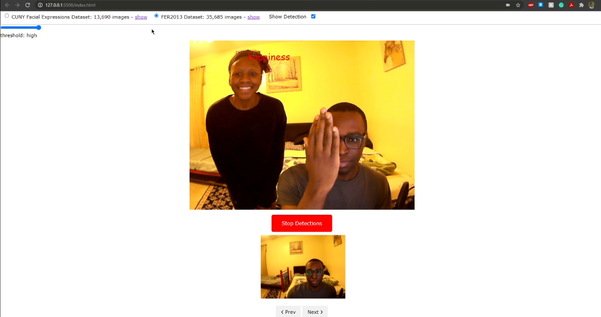

### 1. The frontend code can be found in 'index.html' and 'script.js'
### 2. The backend code can be found in 'model_server.py'

### 3. Please note that the "saved_model" folder was left out of the commit due to the 100mb push limit for GitHub repositories. The model weights in the "saved_model" folder can be provided by Yaw Frempong at yfrempon@uncc.edu. 

### 4. Sources:
#### - "face-api-min.js" file and "models" folder were provided from the WebDevSimplified GitHub: 
https://github.com/WebDevSimplified/Face-Detection-JavaScript
#### - We followed this guide on YouTube by Computer Science to train our emotion classification models: 
https://www.youtube.com/watch?v=iGWbqhdjf2s
#### - The CUNY Facial Expression Dataset is from Brian Lee Yung Rowe's Github: 
https://github.com/muxspace/facial_expressions
#### - The FER2013 Dataset is from Kaggle: 
https://www.kaggle.com/msambare/fer2013

## Team Members:
### Carver Simkins
> #### csimkin1@uncc.edu

### Meghana Palaparthi
> #### mpalapar@uncc.edu

### Yaw Frempong
> #### yfrempon@uncc.edu
